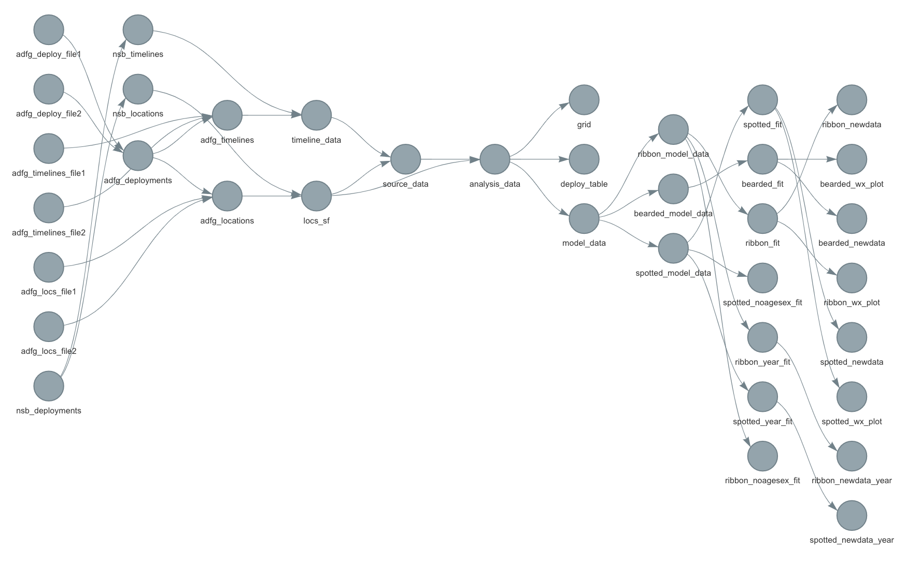

<!-- README.md is generated from README.Rmd. Please edit that file -->

```{r, echo = FALSE}
knitr::opts_chunk$set(
  collapse = TRUE,
  comment = "#>",
  fig.path = "README-"
)
```

<!-- badges: start -->
[](https://doi.org/10.5281/zenodo.4638221)
<!-- badges: end -->

## Haul-out behavior and aerial survey detectability of seals in the Bering and Chukchi seas
Josh M. London^1^,✉, Paul B. Conn^1^, Stacie K. Hardy^1^, Erin L. Richmond^1^, Jay M. Ver Hoef^1^, Michael F. Cameron^1^, Justin Crawford^2^, Andrew L. Von Duyke^3^, Lori T. Quakenbush^2^, and Peter L. Boveng^1^

1. Marine Mammal Laboratory, Alaska Fisheries Science Center, NOAA Fisheries, Seattle, Washington, USA
2. Arctic Marine Mammals Program, Alaska Department of Fish and Game, Fairbanks, Alaska, USA
3. Department of Wildlife Management, North Slope Borough, Utqiaġvik, Alaska, USA

✉ Correspondence: Josh M. London <josh.london@noaa.gov>

This repository contains the research compendium in support of the above titled paper.
The manuscript is currently in preparation and the text, code, analysis, and results
are under active development.

## Draft Manuscript Under Active Development

Please note this manuscript is still in draft form and under active development.
Changes to results, code, and the manuscript are likely and this **should not
be cited without author permission**. We plan to provide a preprint to 
[bioRxiv](https://www.biorxiv.org/) once internal NOAA reviews and final 
revisions are completed.

## Contents

The **analysis** directory contains:

  - [:file\_folder: paper](/analysis/paper): R Markdown source document
    for manuscript. Includes code to reproduce the figures and tables
    generated by the analysis. It also has a rendered MS Word version,
    `London_HauloutBehavior.docx`, suitable for reading (the code is replaced by figures
    and tables in this file)
  - [:file\_folder: figures](/analysis/figures): figures generated
  - [:file\_folder: templates](/analysis/templates): template files and scripts.

The **data** directory contains

  - [:file\_folder: data](/data): data used for model fits and final model output

### {targets} and {renv} packages

This repository relies heavily on the {targets} and {renv} packages for management
of analysis pipelines and reproducibility. 

  - [:file\_folder: R](/R): pipeline functions developed in support of target pipeline
  - [:page\_facing\_up: _targets.R](/_targets.R): target pipeline
  - [:page\_facing\_up: renv.lock](/renv.lock): renv lockfile
  
The dependency graph for our pipeline is shown below



## Inspiration

I would like to provide special acknowledgement to Ben Marwick and Carl Boetinger.
This research compendium borrows heavily from Ben's [{rrtools}](https://github.com/benmarwick/rrtools)
package. Carl's example research compendiums ([https://github.com/cboettig/noise-phenomena](https://github.com/cboettig/noise-phenomena) and
[https://github.com/cboettig/nonparametric-bayes](https://github.com/cboettig/nonparametric-bayes)) were
also of great use when adapting the structure to meet my needs.
